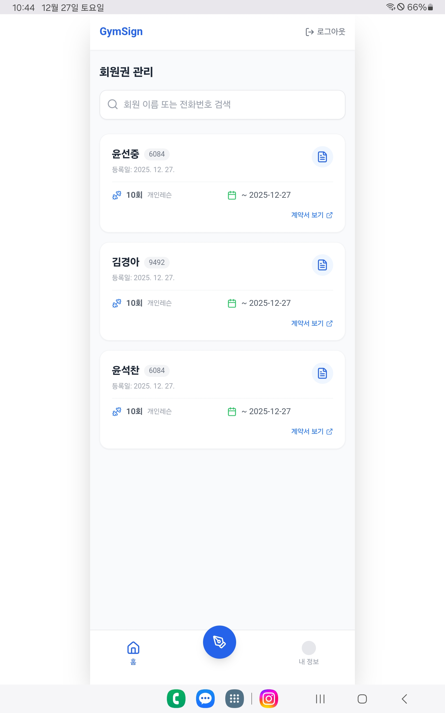
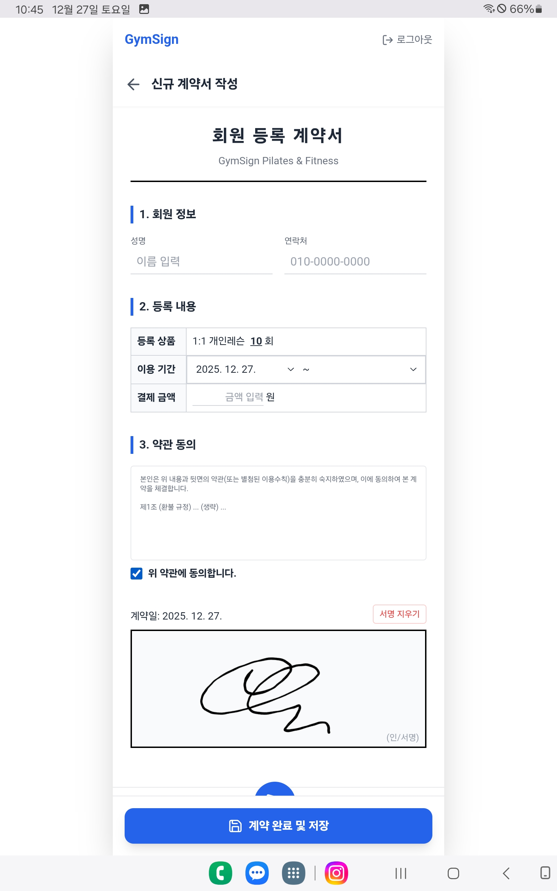
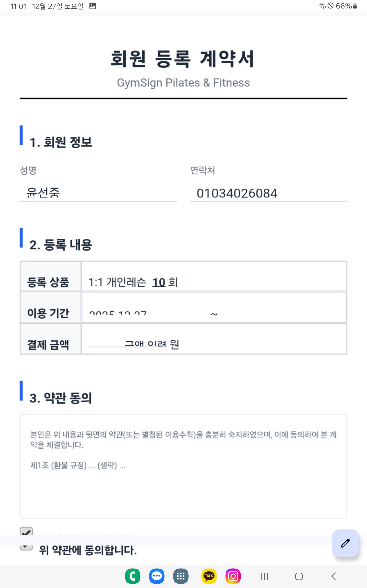

# 🏋️‍♀️ GymSign (짐사인)

> **Paperless Electronic Contract & Member Management System for Fitness Centers**
> 필라테스 및 피트니스 센터를 위한 태블릿 최적화 전자계약 솔루션


<br/>

## 📖 프로젝트 소개 (Introduction)

**GymSign**은 종이 계약서의 물리적 보관 한계와 분실 위험을 해결하기 위해 개발된 **1인 개발자 및 소규모 스튜디오 전용 전자계약 시스템**입니다.

관리자는 태블릿이나 PC를 통해 회원의 정보를 입력하고, 회원은 현장에서 즉시 전자 서명을 할 수 있습니다. 서명이 완료된 계약서는 자동으로 **PDF로 변환**되어 클라우드 스토리지에 영구 보관되며, 언제 어디서든 검색하고 열람할 수 있습니다.

**Serverless Architecture**로 구축되어 유지비용을 최소화했으며, **PWA(Progressive Web App)** 기술을 적용하여 별도의 앱 스토어 심사 없이 모바일 기기 홈 화면에 앱처럼 설치하여 사용할 수 있습니다.

<br/>

## ✨ 주요 기능 (Key Features)

* **✍️ 전자 서명 (Electronic Signature):** HTML5 Canvas를 활용하여 터치 및 마우스 서명을 지원하며, 서명 데이터는 이미지로 안전하게 처리됩니다.
* **📄 PDF 자동 변환 (Auto PDF Generation):** 계약서 UI를 캡처하여 A4 규격의 고해상도 PDF 파일로 즉시 변환합니다.
* **☁️ 클라우드 자동 저장 (Cloud Storage):** 생성된 PDF는 Supabase Storage에 자동 업로드되며, 고유 URL을 통해 안전하게 접근 가능합니다.
* **📱 PWA 지원 (App-like Experience):** `vite-plugin-pwa`를 적용하여 모바일/태블릿 홈 화면에 추가 시 네이티브 앱과 동일한 전체 화면 경험(Full-screen)을 제공합니다.
* **🔍 회원 관리 대시보드:** 회원 이름 및 연락처로 실시간 검색이 가능하며, 등록 횟수, 기간, 계약서 원본을 한눈에 관리할 수 있습니다.
* **🔒 관리자 보안:** Supabase Auth 및 RLS(Row Level Security)를 적용하여 관리자 외에는 데이터 접근이 불가능하도록 보안을 강화했습니다.

<br/>

## 📸 스크린샷 (Screenshots)

|                메인 대시보드 (회원 목록)                | 계약서 작성 및 서명 |
|:---------------------------------------------:|:---:|
|  |  |

| PDF 뷰어 (계약서 확인) | 모바일 PWA 구동 화면 |
|:---:|:---:|
|  |  |

<br/>

## 🛠 기술 스택 (Tech Stack)

### Frontend
* **Core:** React (v18), TypeScript, Vite
* **Styling:** Tailwind CSS (v3)
* **PWA:** `vite-plugin-pwa` (Manifest, Icons, Offline Caching)
* **UI Components:** Lucide React (Icons)

### Logic & Utilities
* **PDF Generation:** `jspdf`, `html2canvas`
* **Signature:** `react-signature-canvas`
* **Routing:** React Router DOM (v6)

### Backend (BaaS)
* **Platform:** [Supabase](https://supabase.com)
* **Database:** PostgreSQL
* **Storage:** Supabase Storage (Bucket)
* **Authentication:** Supabase Auth (Email/Password)
* **Security:** RLS (Row Level Security) Policies

<br/>

## 🏗 시스템 구조 (Architecture)


<br/>

## 🚀 시작하기 (Getting Started)

이 프로젝트를 로컬 환경에서 실행하려면 다음 단계들을 따라주세요.

### 1. 프로젝트 클론 (Clone)
```bash
git clone [https://github.com/YOUR_USERNAME/gym-sign.git](https://github.com/YOUR_USERNAME/gym-sign.git)
cd gym-sign
```

### 2. 패키지 설치 (Install Dependencies)
```bash
npm install
```

### 3. 환경 변수 설정 (Environment Variables)
프로젝트 루트 경로에 `.env.local` 파일을 생성하고, Supabase 프로젝트 대시보드에서 발급받은 키를 입력합니다.

```env
VITE_SUPABASE_URL=[https://your-project-url.supabase.co](https://your-project-url.supabase.co)
VITE_SUPABASE_ANON_KEY=your-anon-key-here
```

### 4. 데이터베이스 및 스토리지 설정 (Supabase Setup)
Supabase SQL Editor에서 아래 SQL 스크립트를 실행하여 필요한 테이블과 보안 정책을 한 번에 설정합니다.

<details>
<summary>👉 <b>SQL 스크립트 보기 (Click to expand)</b></summary>

```sql
-- 1. UUID 확장 기능 활성화
CREATE EXTENSION IF NOT EXISTS "uuid-ossp";

-- 2. Members (회원 정보) 테이블 생성
CREATE TABLE IF NOT EXISTS public.members (
    id UUID DEFAULT uuid_generate_v4() PRIMARY KEY,
    created_at TIMESTAMP WITH TIME ZONE DEFAULT now(),
    name TEXT NOT NULL,
    phone TEXT NOT NULL UNIQUE,
    memo TEXT
);

-- 3. Contracts (계약서) 테이블 생성
CREATE TABLE IF NOT EXISTS public.contracts (
    id UUID DEFAULT uuid_generate_v4() PRIMARY KEY,
    created_at TIMESTAMP WITH TIME ZONE DEFAULT now(),
    member_id UUID NOT NULL REFERENCES public.members(id) ON DELETE CASCADE,
    session_count INTEGER NOT NULL,
    start_date DATE NOT NULL,
    end_date DATE NOT NULL,
    price INTEGER,
    file_url TEXT NOT NULL,
    signed_at TIMESTAMP WITH TIME ZONE DEFAULT now()
);

-- 4. Storage Bucket 생성
INSERT INTO storage.buckets (id, name, public) 
VALUES ('contracts', 'contracts', true)
ON CONFLICT (id) DO NOTHING;

-- 5. RLS (Row Level Security) 설정 - 로그인한 사용자만 접근 허용
ALTER TABLE public.members ENABLE ROW LEVEL SECURITY;
ALTER TABLE public.contracts ENABLE ROW LEVEL SECURITY;

CREATE POLICY "Enable all for authenticated users only" ON public.members
    FOR ALL USING (auth.role() = 'authenticated');

CREATE POLICY "Enable all for authenticated users only" ON public.contracts
    FOR ALL USING (auth.role() = 'authenticated');
    
-- 6. Storage 보안 정책 설정
CREATE POLICY "Allow authenticated uploads" ON storage.objects
    FOR INSERT TO authenticated WITH CHECK (bucket_id = 'contracts');
    
CREATE POLICY "Allow authenticated select" ON storage.objects
    FOR SELECT TO authenticated USING (bucket_id = 'contracts');
    
CREATE POLICY "Allow authenticated update/delete" ON storage.objects
    FOR UPDATE TO authenticated USING (bucket_id = 'contracts');
    
CREATE POLICY "Allow authenticated delete" ON storage.objects
    FOR DELETE TO authenticated USING (bucket_id = 'contracts');
```
</details>

### 5. 로컬 서버 실행 (Run)
```bash
npm run dev
```

<br/>

## 📂 폴더 구조 (Folder Structure)

```
src/
├── components/      # Layout, Header, Modal 등 공통 컴포넌트
├── lib/             # Supabase Client 인스턴스 설정
├── pages/           # 라우트별 페이지 컴포넌트
│   ├── Dashboard.tsx    # 메인 화면 (리스트 및 검색)
│   ├── ContractWrite.tsx # 계약서 작성 및 서명
│   └── Login.tsx        # 관리자 로그인
├── utils/           # 유틸리티 함수
│   └── createPdf.ts     # HTML -> PDF 변환 로직
├── App.tsx          # 메인 라우팅 및 세션 관리
└── main.tsx         # 진입점 (Entry Point)
```

<br/>

## 🤝 기여하기 (Contributing)
이슈 제보와 Pull Request는 언제나 환영합니다!
1. Fork this Project
2. Create your Feature Branch (`git checkout -b feature/AmazingFeature`)
3. Commit your Changes (`git commit -m 'Add some AmazingFeature'`)
4. Push to the Branch (`git push origin feature/AmazingFeature`)
5. Open a Pull Request

<br/>

## 📝 라이선스 (License)
This project is licensed under the MIT License - see the [LICENSE](LICENSE) file for details.

---
**Created by [Yoonseokchan](https://github.com/Yoonseokchan)**
